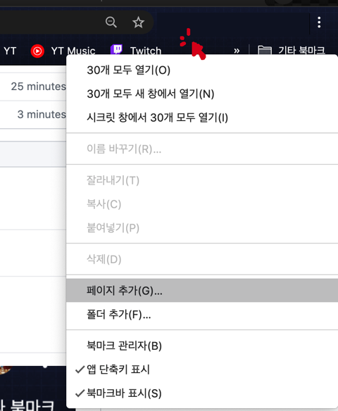
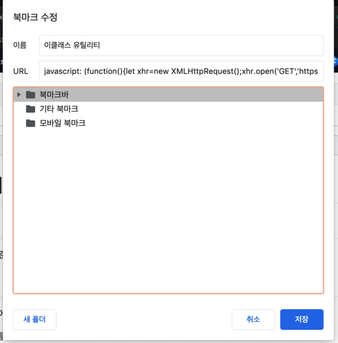

# 악용하지 마시오

## 개요
소스코드는 구글 크롬을 기준으로 작성됨.

## 설치



구글 크롬에서 [북마크바 위에 마우스 커서를 올리고 **우클릭**]-[페이지 추가] 클릭
* 북마크바는 (Ctrl+Shift+B)를 누르면 나타남.



* 이름: *적당히 아무 이름으로 설정*
* URL: **(중요)** *본래 내용을 지우고, 아래의 '코드 전체'를 복사 붙여넣기*

```javascript
javascript: (function(){'use-strict';let xhr=new XMLHttpRequest();xhr.open('GET','https://raw.githubusercontent.com/Hepheir/web_functions/master/dgu-eclass-vulnerable/linker-compressed.js');xhr.onreadystatechange=()=>{if(xhr.readyState==XMLHttpRequest.DONE)eval(xhr.responseText);};xhr.send();})();
```

그리고 저장.

## 실행
이클래스 홈페이지에서 '설치'과정에서 생성한 북마크를 실행.

> 이클래스 유틸리티 기능이 활성화 되었습니다.

라는 문구가 뜨면 성공.

## 종료
위에서 생성한 북마크를 한번 더 실행.

종료를 묻는 문구가 뜨면 [확인] 선택.
